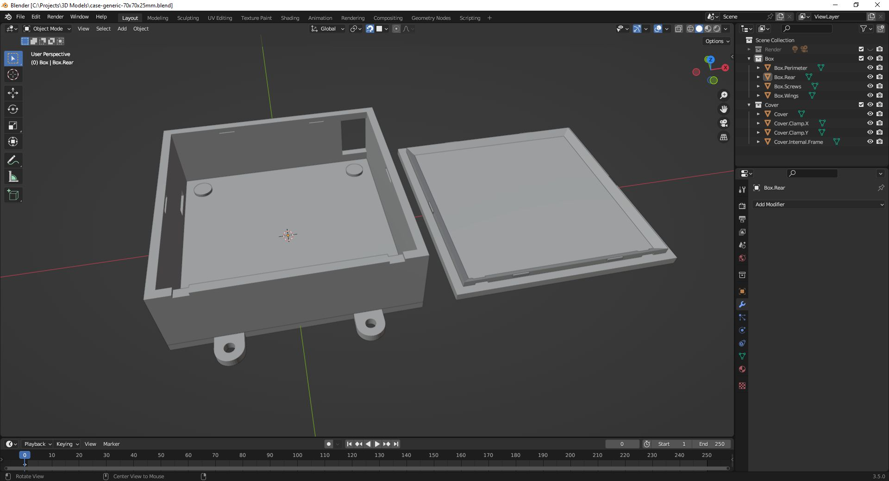
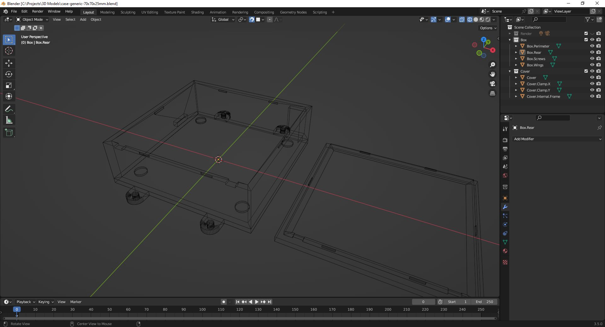
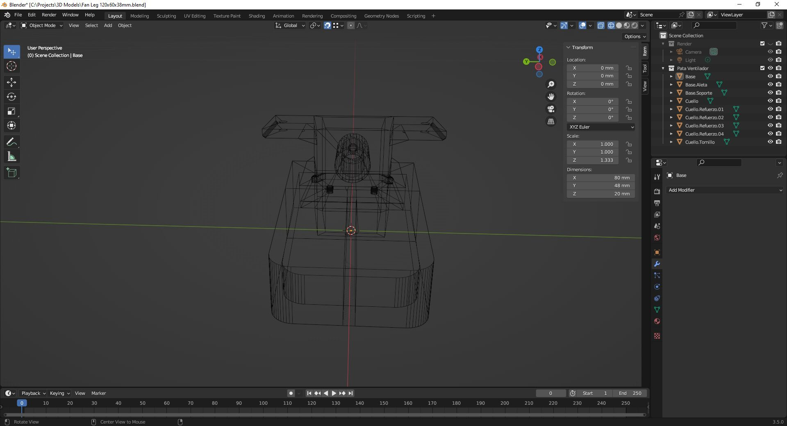

# 3D Models

A collection of 3D models made on Blender.    
STL & Blender files are provided for each 3D model.

&nbsp;

### Screenshots

| Case Generic 70x70x25mm                                  | Case Generic 70x70x25mm                                  |
|----------------------------------------------------------|----------------------------------------------------------|
|              |              |

| Case Custom 135x80x33mm                                  | Case Custom 135x80x33mm                                  |
|----------------------------------------------------------|----------------------------------------------------------|
|             |             |
  
| Case Double-Switch 220v 50x28x40mm                       | Case Double-Switch 220v 50x28x40mm                       |
|----------------------------------------------------------|----------------------------------------------------------|
|   |   |

| Fan Leg 120x60x36mm                                      | Fan Leg 120x60x36mm                                      |
|----------------------------------------------------------|----------------------------------------------------------|
|                  |                  |

See 'Rescources' sub-folder for more pictures & videos of the project.

&nbsp;

### Version History

v1.0 (2023.05.19) - Initial release.  

&nbsp;

This source code is licensed under Public Domain license.  
Please send me your feedback about this project: andres.garcia.alves@gmail.com
