# 3D Models

A collection of 3D models made on Blender.    
STL & Blender files are provided for each 3D model.

&nbsp;

### Screenshots

| Bolt Piece 99x18x12mm                                    | Bolt Piece 99x18x12mm                                    |
|----------------------------------------------------------|----------------------------------------------------------|
| 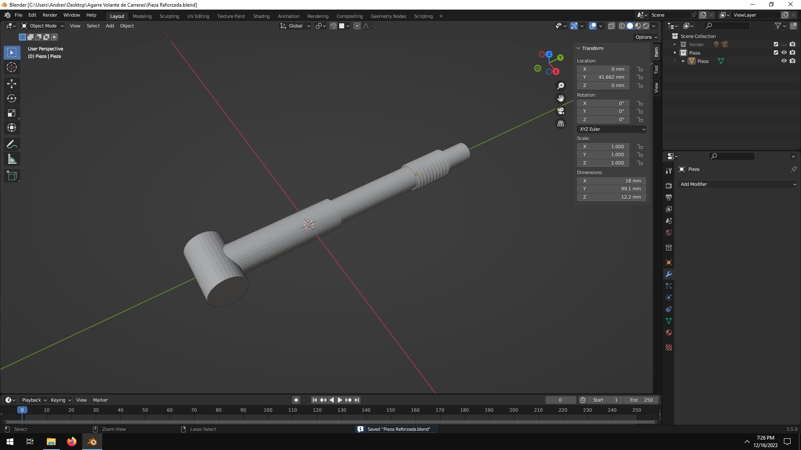               | 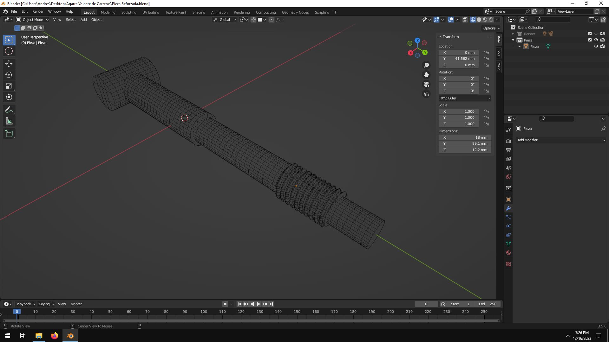               |

| Case 18650 Batteries & TP4056 129x80x28mm                | Case 18650 Batteries & TP4056 129x80x28mm                |
|----------------------------------------------------------|----------------------------------------------------------|
| 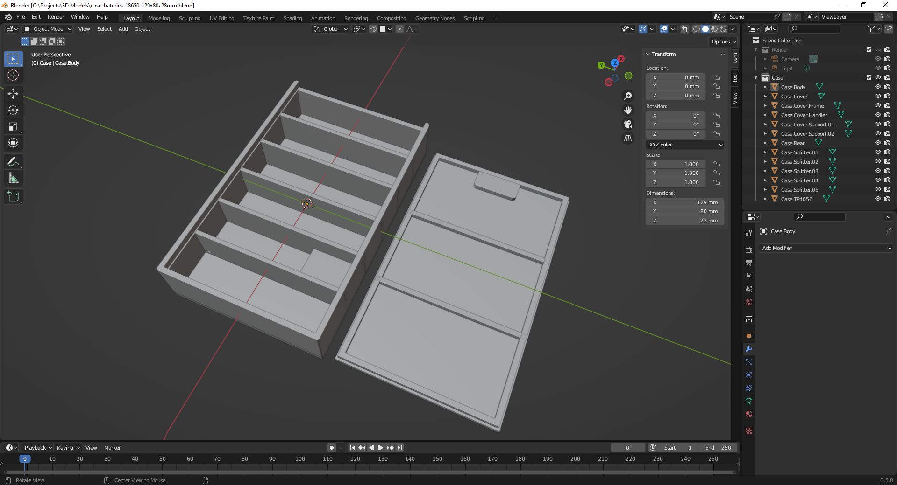    | 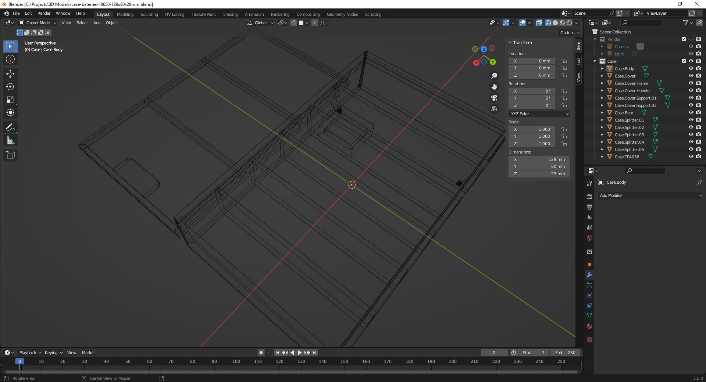    |

| Case Generic 70x70x25mm                                  | Case Generic 70x70x25mm                                  |
|----------------------------------------------------------|----------------------------------------------------------|
|              |              |

| Case Custom 135x80x33mm                                  | Case Custom 135x80x33mm                                  |
|----------------------------------------------------------|----------------------------------------------------------|
|             |             |
  
| Case Double-Switch 220v 50x28x40mm                       | Case Double-Switch 220v 50x28x40mm                       |
|----------------------------------------------------------|----------------------------------------------------------|
|   |   |

| Case Power Supply Unit 110x90x45mm                       | Case Power Supply Unit 110x90x45mm                       |
|----------------------------------------------------------|----------------------------------------------------------|
| 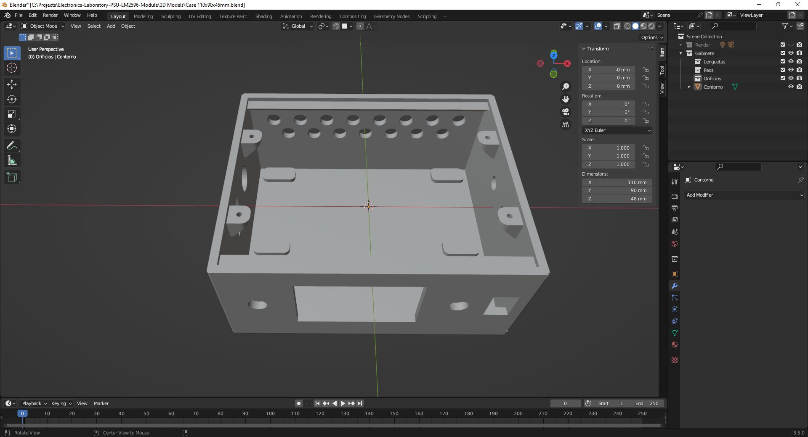                |                 |

| Holder 18650 Battery x1 76x23x17mm                       | Holder 18650 Battery Holder x1 76x23x17mm                |
|----------------------------------------------------------|----------------------------------------------------------|
| 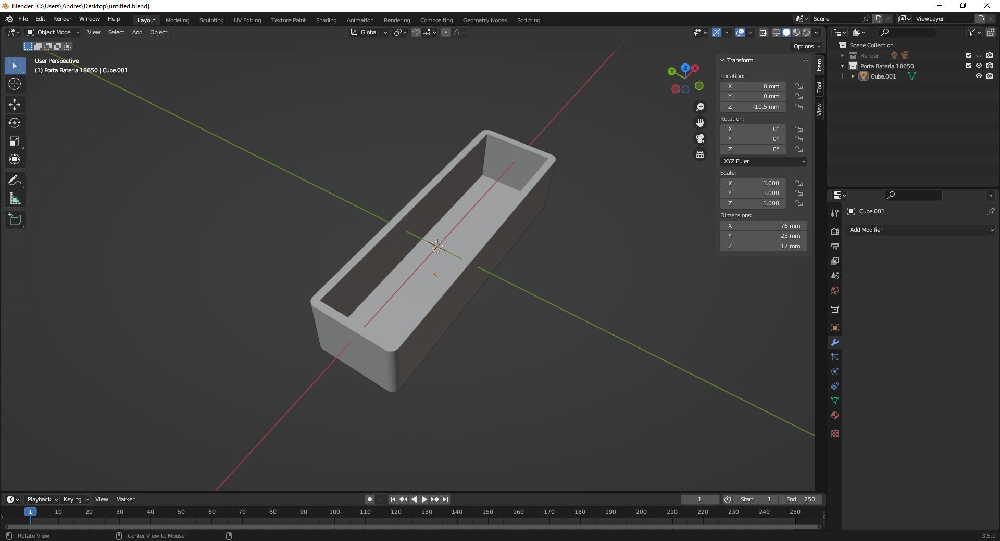     | 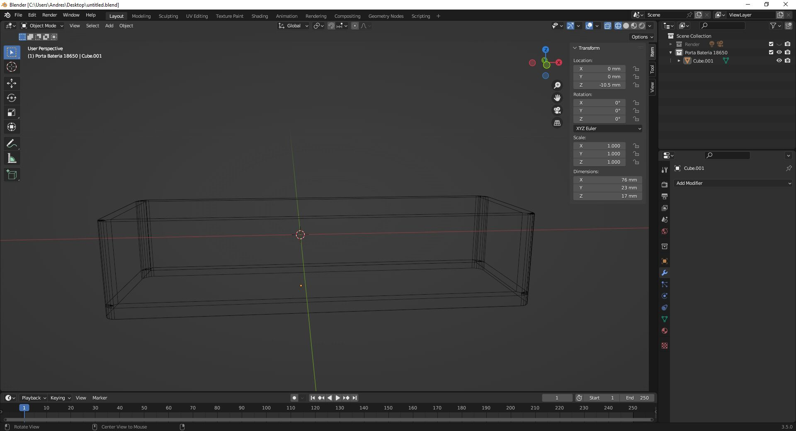     |

| Fan Leg 120x60x36mm                                      | Fan Leg 120x60x36mm                                      |
|----------------------------------------------------------|----------------------------------------------------------|
| 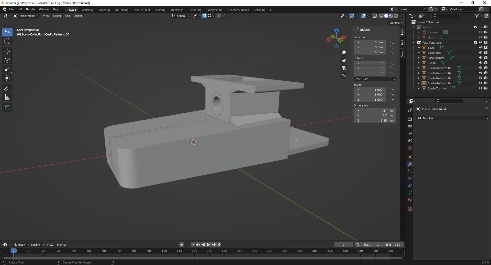                 |                  |

| Iron Knob 46x46x13mm                                     | Iron Knob 46x46x13mm                                     |
|----------------------------------------------------------|----------------------------------------------------------|
|                 | 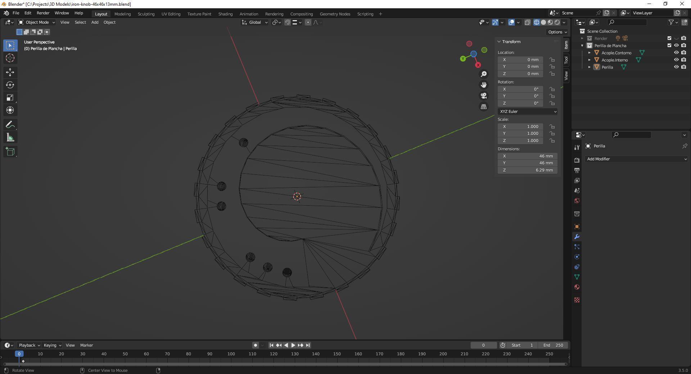                |

| Keyboard Leg 20x26x3mm                                   | Keyboard Leg 20x26x3mm                                   |
|----------------------------------------------------------|----------------------------------------------------------|
| 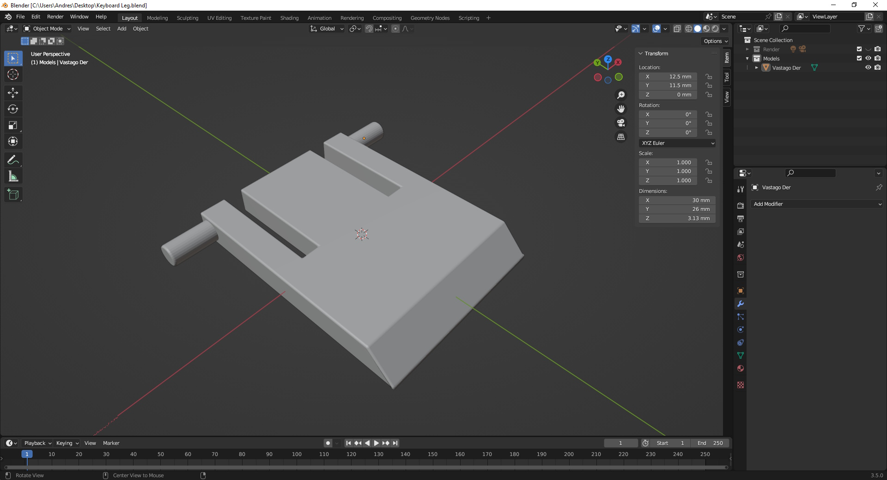              | 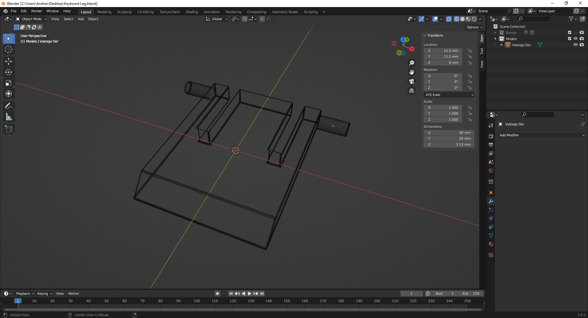              |

See 'Rescources' sub-folder for more pictures & videos of the project.

&nbsp;

### Version History

v1.0 (2023.05.19) - Initial release.  
v1.1 (2023.05.21) - Adding model 'case-generic-70x70x25mm'.  
v1.2 (2023.05.27) - Adding model 'case-bateries-18650-129x80x28mm'.  
v1.3 (2023.06.01) - Adding model 'iron-knob-46x46x13mm'.  
v1.4 (2023.06.28) - Adding model 'case-psu-110x90x45mm'.  
v1.5 (2023.07.14) - Adding model 'holder-battery-18650-76x23x17mm'.  
v1.6 (2023.09.03) - Adding model 'keyboard-leg-20x26x3mm'.  
v1.7 (2023.12.16) - Adding model 'bolt-piece-99x18x12mm'.

&nbsp;

This source code is licensed under Public Domain license.  
Please send me your feedback about this project: andres.garcia.alves@gmail.com
